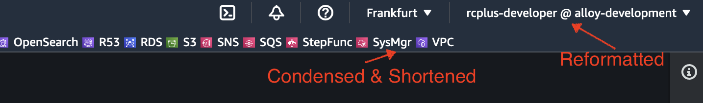
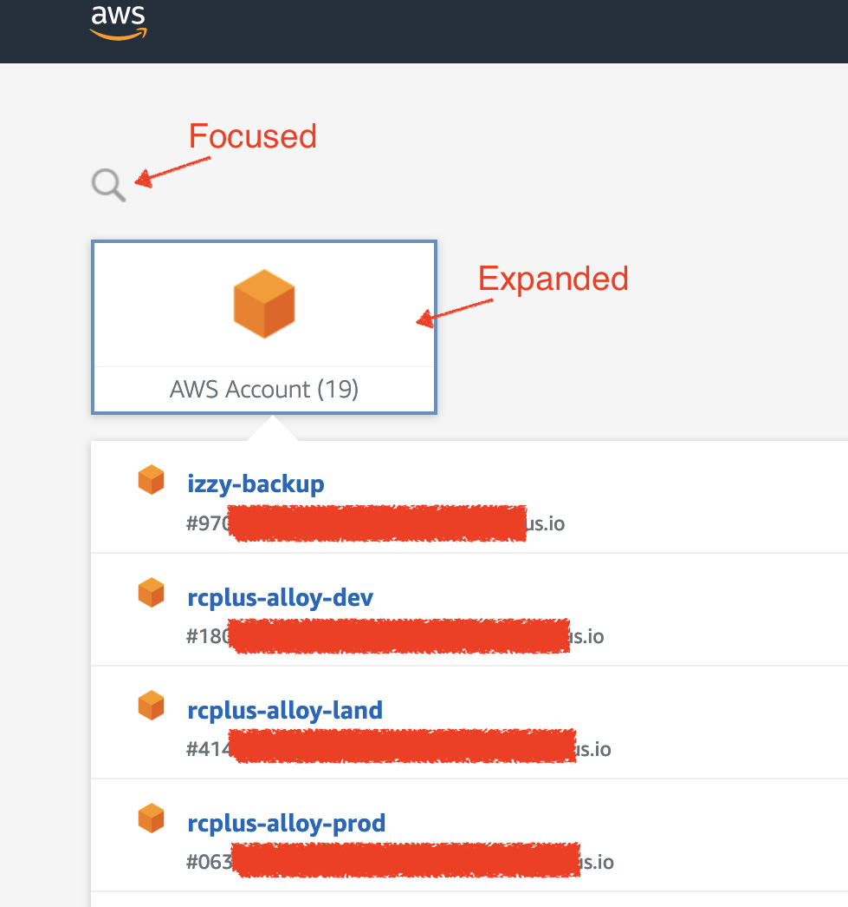

# rcplus-toys-greasemonkey-scripts
GreaseMonkey/TamperMonkey scripts for RC+ daily development

## Usage

Install one of the following:
* [Tampermonkey](https://www.tampermonkey.net), not open source, available for all main stream browsers, paid extension for Safari  
* [Greasemonkey](https://addons.mozilla.org/en-US/firefox/addon/greasemonkey/), open source, Firefox only
* [Violentmonkey](https://violentmonkey.github.io), open source, available for Chrome/Edge/Vivaldi and Firefox but not Safari 

Google for the detailed comparison, e.g. https://news.ycombinator.com/item?id=22896078

Then, add a new user script by copy/paste. TamperMonkey periodically check the version for auto updates.

## Scripts

---

[**rcplus-toys-aws-web-console-header-optimizer**](https://raw.githubusercontent.com/zhaow-de/rcplus-toys-greasemonkey-scripts/main/rcplus-toys-aws-web-console-header-optimizer.js)

### Purpose

* Reformat the username text in the top-right corner to "role @ account" by removing username and adding account alias.
  (Because we use Okta as the upstream IdP for AWS SSO, the username is almost always constant)
* Reduce the padding of unified favorites bar items, and shorten some names with abbreviation.
  (e.g. "Elastic Kubernetes Service" -> "EKS", or "IAM Identity Center (successor to AWS Single Sign-On)" -> "SSO")

### Change History

* 20221127: **0.2** Reworked the list elements waiting logic to handle React DOM lazy loading
* 20221126: **0.1** Initial release

---

[**rcplus-toys-aws-sso-portal-apps-expander**](https://raw.githubusercontent.com/zhaow-de/rcplus-toys-greasemonkey-scripts/main/rcplus-toys-aws-sso-portal-apps-expander.js)

### Purpose

Automatically expand AWS SSO portal apps and focus mouse cursor in the search field.

### Change History

* 20221126: **0.1** Initial release

---
